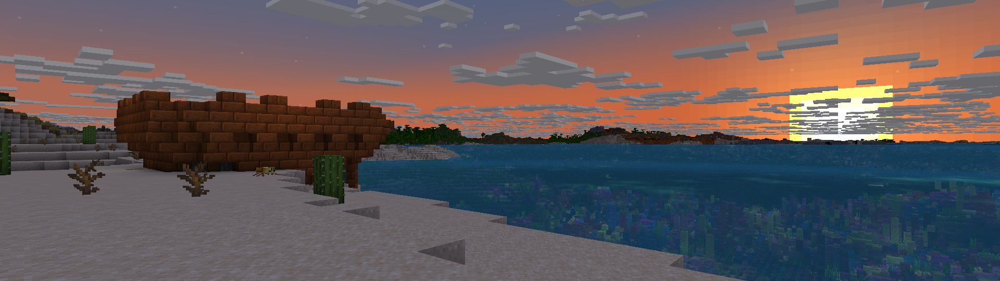

<h1 align="center">Desolate Dungeons 
    
    
</h1>
Desolate Dungeons is currently Work in Progress. While it is in a playable state, it is far from being complete.
Desolate Dungeons is a dimension-based adventure mod with roguelike elements. You enter the dimension with nothing
and progress by overcoming challenges, earning loot and rewards you can return to the Overworld with.

## Licensing
### Code
This Mod's source code is licensed under the GNU Lesser General Public License v3.0.
You can find a copy of the license in the [LICENSE](./LICENSE) file located in the root directory.
 SPDX identifier: `LGPL-3.0-or-later`.
### Assets
Unless otherwise stated, this Mod's assets, including (but not limited to) textures, sounds, structure files, and other non-code files are licensed separately under the CC BY-SA 4.0 License.
You can find a copy of the license in the [LICENSE_ASSETS](./LICENSE_ASSETS) file located in the root directory.
 SPDX identifier: `CC-BY-SA-4.0`.

## Thanks!
Thanks for your interest in Desolate Dungeons! This is a long term project, so it will take a while until the first version is out.
If you have any issues or feedback, feel free to open a new issue under the [Issues tab](https://github.com/dassenyy/DesolateDungeons/issues),
or contact me via [pm@dassen.dev](mailto:pm@dassen.dev?subject=Feedback%20/%20Issue%20regarding%20DesolateDungeons&body=%0D%0A%0D%0AThis%20mail%20is%20related%20to%20the%20following%20project%20on%20GitHub%3A%20%0D%0Ahttps%3A%2F%2Fgithub.com%2Fdassenyy%2FDesolateDungeons).